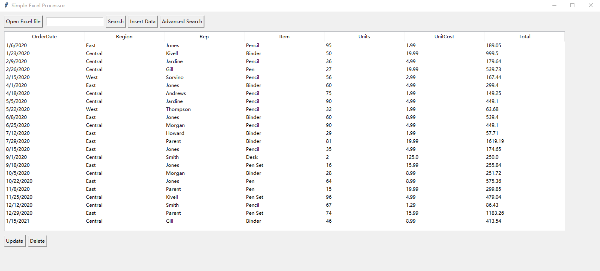
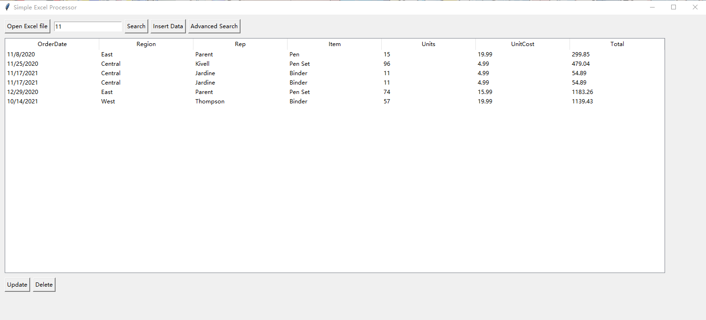
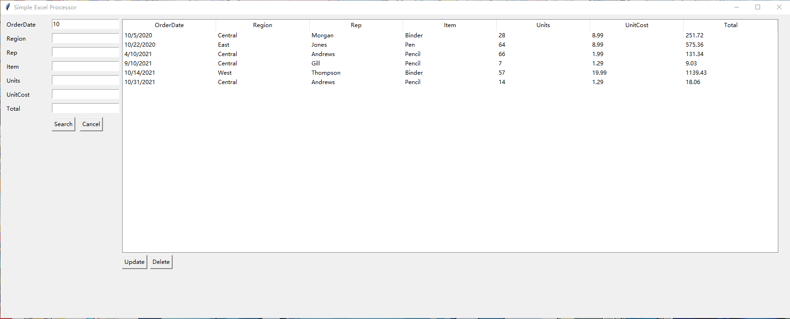

# excel-processor
## Introduction
This is a simple excel file process program that I created with Python. Users can use this program to perform CRUD operations on Excel files

## How to Use
To start the program, double click main.py, then click "Open Excel File" button and select a valid excel file, then the table will be showed above. Users can select one of the row and update or delete it. The home menu also have fuzzy search function, an advanced search function is also provided. 

### Note: Currently this program can only process the first table of the file and any manipulation of the data will be automatically saved to the excel file. 

## Screenshots

  
Home Menu

  

 

  
Fuzzy Search

  

 

  
Advanced Search

  

 

  
Update Data

  

 

  
Insert Data

  

## License
This project is licensed under the Apache-2.0 license - see the LICENSE file for details.

## Feedback
If you have any feedback or suggestions for this project, feel free to open an issue on GitHub.
